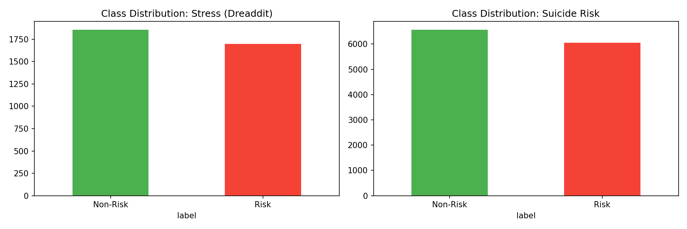
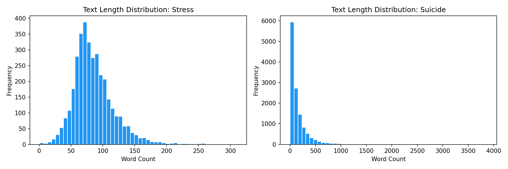
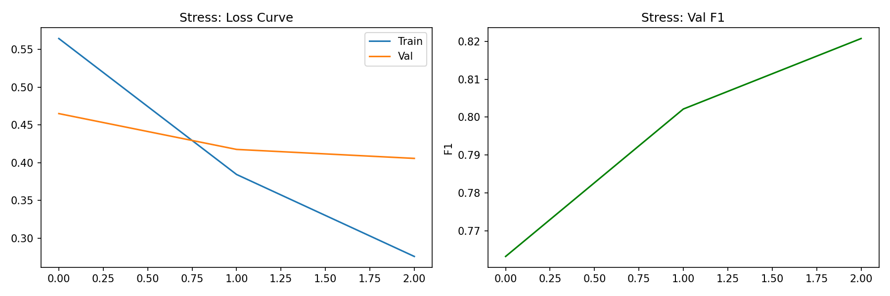
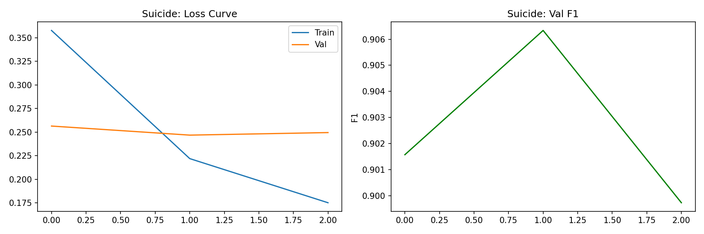
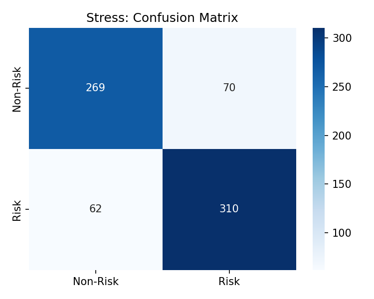
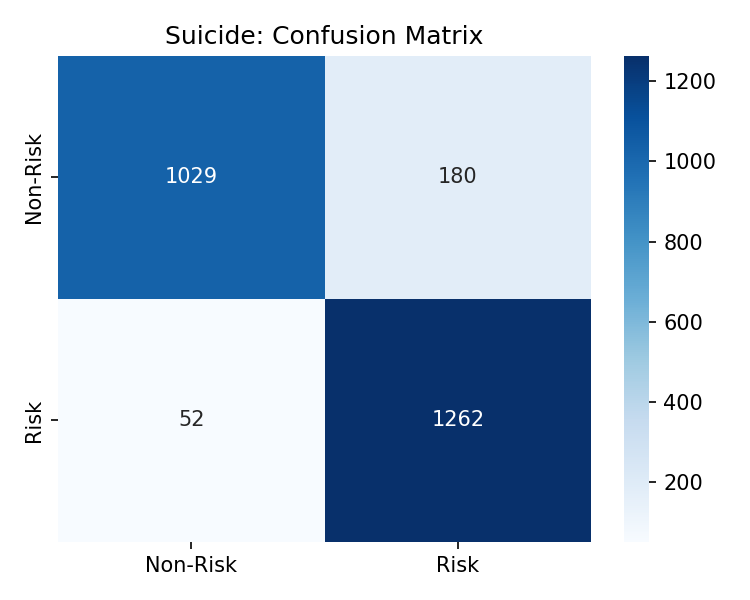
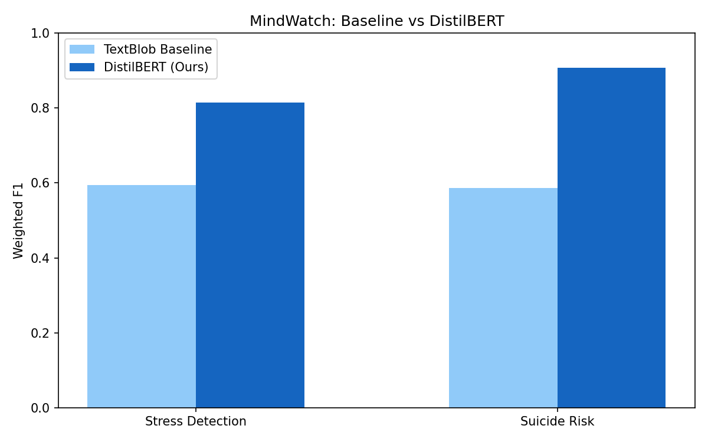

# MindWatch: Multi-Task Mental Health Risk Detection using NLP

A research project for detecting stress and suicide risk in Reddit posts using fine-tuned DistilBERT, evaluated across two benchmark datasets.

---

## Overview

Mental health risk detection in social media is a critical NLP challenge. **MindWatch** frames this as a dual-task classification problem:

- **Task 1 — Stress Detection:** Classify Reddit posts as stress or non-stress using the Dreaddit dataset
- **Task 2 — Suicide Risk Detection:** Classify Reddit posts as suicidal or non-suicidal using the Suicidal Ideation Reddit dataset

Both tasks are benchmarked against a TextBlob sentiment baseline and a fine-tuned DistilBERT model.

> **Disclaimer:** This project is for research and educational purposes only. It is not a diagnostic or clinical tool and should not be used for real-world mental health decisions.

---

## Datasets

| Dataset | Task | Samples | Balance |
|---|---|---|---|
| [Dreaddit](https://aclanthology.org/D19-6213/) (Turcan & McKeown, 2019) | Stress Detection | 3,553 | 52% stress / 48% non-stress |
| [Suicidal Ideation Reddit](https://www.kaggle.com/datasets/rvarun11/suicidal-ideation-reddit-dataset) | Suicide Risk Detection | 12,615 | 52% suicidal / 48% non-suicidal |

---

## Methodology

### Preprocessing
- Removed null entries and retained only text and label columns
- Tokenized using DistilBERT tokenizer with max sequence length of 128
- Stratified 80/10/20 train/validation/test split for both tasks

### Models
- **Baseline:** TextBlob sentiment polarity thresholding (negative polarity → risk)
- **Proposed:** `distilbert-base-uncased` fine-tuned for sequence classification using HuggingFace Transformers with linear warmup scheduler and AdamW optimizer (lr=2e-5, 3 epochs, batch size=32)

---

## Class Distribution





---

## Training Curves

### Stress Detection


### Suicide Risk Detection


---

## Results

### Stress Detection (Dreaddit)

| Metric | Non-Risk | Risk | Weighted Avg |
|---|---|---|---|
| Precision | 0.81 | 0.82 | — |
| Recall | 0.79 | 0.83 | — |
| F1-Score | 0.80 | 0.82 | 0.8142 |
| Accuracy | — | — | 81.43% |
| AUC-ROC | — | — | 0.8876 |



---

### Suicide Risk Detection

| Metric | Non-Risk | Risk | Weighted Avg |
|---|---|---|---|
| Precision | 0.95 | 0.88 | — |
| Recall | 0.85 | 0.96 | — |
| F1-Score | 0.90 | 0.92 | 0.9076 |
| Accuracy | — | — | 90.80% |
| AUC-ROC | — | — | 0.9639 |



---

## Baseline vs DistilBERT Comparison



| Task | TextBlob Baseline F1 | DistilBERT F1 | Improvement |
|---|---|---|---|
| Stress Detection | 0.5947 | 0.8142 | +21.9 pts |
| Suicide Risk Detection | 0.5866 | 0.9076 | +32.1 pts |

---

## Tools and Libraries

- Python, PyTorch, HuggingFace Transformers
- Scikit-learn, Pandas, NumPy
- Matplotlib, Seaborn, TextBlob
- Jupyter Notebook (Kaggle GPU environment)

---

## Evaluation Protocol

- Train/Val/Test split: 80/10/20 stratified
- Stress test set: 711 samples | Suicide test set: 2,523 samples
- Metrics: Accuracy, Weighted F1, AUC-ROC, Precision, Recall, Confusion Matrix
- Hardware: Kaggle GPU (Tesla P100)

---

## Citation

```bibtex
@inproceedings{turcan-mckeown-2019-dreaddit,
    title = "Dreaddit: A Reddit Dataset for Stress Analysis in Social Media",
    author = "Turcan, Elsbeth and McKeown, Kathy",
    booktitle = "Proceedings of the Tenth International Workshop on Health Text Mining and Information Analysis (LOUHI 2019)",
    year = "2019",
    pages = "97--107"
}
```
